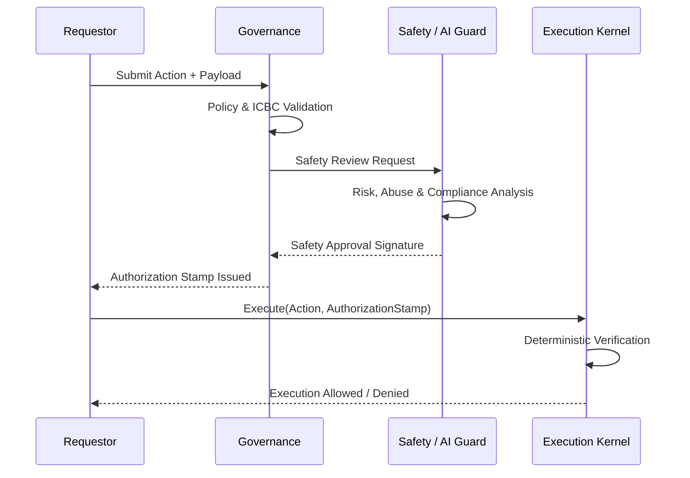

# Authorization Stamp — Cryptographic Authority Chain Specification

## Purpose

The **Authorization Stamp** is the cryptographic enforcement mechanism of the  
**TEOS Sovereign Authority Chain**.

It provides **machine-verifiable, non-repudiable proof** that a requested action:

1. Originated from a valid and registered authority level  
2. Passed all required governance and safety controls  
3. Was explicitly approved by accountable human institutional authority  
4. Fully complies with ICBC constitutional rules and TESL licensing constraints  

> **No execution may occur without a valid Authorization Stamp.**

This requirement is **absolute**, not advisory.

---

## Constitutional Principle

> **Authority flows downward only.**  
> Execution never creates authority.

The Authorization Stamp is the **sole admissible proof** that an action has
lawfully traversed the Authority Chain:

**ICBC → Governance → Safety → Execution**

Any action lacking this traversal is **constitutionally void**.

---

## Scope of Use

Authorization Stamps are **MANDATORY** for all state-affecting or sovereign actions, including:

- Treasury movements (vault creation, transfers, burns)
- Policy execution or enforcement
- Governance parameter changes
- AI-assisted, semi-automated, or fully automated actions
- Any action mutating sovereign data, funds, rights, or registries

Authorization Stamps are **NOT required** for:

- Read-only queries
- Public or non-sensitive data access
- Passive audit inspection (non-mutating)

---

## Authorization Stamp Data Model (Canonical)

All required fields are mandatory. Their absence invalidates the Authorization Stamp.  
Optional fields may only further restrict execution or improve auditability and must never reduce, bypass, or weaken enforcement.

### Required Fields

| Field | Description |
|---|---|
| `stamp_version` | Canonical version identifier (e.g., `AUTH-1.0`) |
| `action_id` | Globally unique identifier for the requested action |
| `action_type` | Enumerated action class (e.g., `VAULT_TRANSFER`) |
| `request_hash` | SHA-256 hash of the canonical action payload |
| `authority_chain_hash` | SHA-256 hash of the canonical `AUTHORITY-CHAIN.md` |
| `pai_receipt_hash` | Hash of the linked PAI Receipt (if applicable) |
| `initiator_pubkey` | Public key of the initiating authority |
| `governance_signature` | Governance-layer signature over `STAMP_HASH` |
| `safety_signature` | Safety / AI Guard signature over `STAMP_HASH` |
| `execution_scope` | Explicit, bounded scope of what execution is permitted |
| `issued_at_utc` | ISO-8601 UTC issuance timestamp |
| `expiry_utc` | Optional expiration timestamp (strongly recommended) |

---

## Canonicalization & Hashing

1. Serialize all required fields into **canonical JSON**:
   - Lexicographically sorted keys  
   - UTF-8 encoding  
   - Deterministic formatting (no whitespace ambiguity)

2. Compute:

```text
STAMP_HASH = SHA-256(canonical_json_string)
````

The `STAMP_HASH` is the **single immutable authority reference**.

---

## Signature Requirements

### Mandatory Signatures

| Layer             | Requirement            |
| ----------------- | ---------------------- |
| Governance        | MUST sign `STAMP_HASH` |
| Safety / AI Guard | MUST sign `STAMP_HASH` |
| Execution         | **MUST NEVER sign**    |

> Execution is constitutionally prohibited from generating or endorsing authority.

### Signature Rules

* One cryptographic scheme **system-wide only** (Ed25519 or ECDSA)
* Public keys MUST be:

  * Registered
  * Badge-verified
  * Revocation-tracked
* Any missing, malformed, expired, or invalid signature results in **automatic rejection**

---

## Authorization Flow (Conceptual)



---

## Execution Kernel Enforcement Rules

The Execution Kernel **MUST** perform the following checks **in strict order**:

1. **Stamp presence**
   → Reject if missing

2. **Stamp hash integrity**
   → Recompute and compare

3. **Authority chain consistency**
   → `authority_chain_hash` MUST match the current canonical document

4. **Signature verification**

   * Governance signature valid
   * Safety signature valid

5. **Scope enforcement**
   → Action MUST be fully contained within `execution_scope`

6. **Expiry enforcement** (if defined)

> Failure at any step **halts execution immediately**.

---

## Minimal Verification Logic (Pseudocode)

```text
FUNCTION verify_and_execute(action_payload, authorization_stamp):

  ASSERT authorization_stamp EXISTS

  computed_hash = SHA256(canonicalize(authorization_stamp))
  ASSERT computed_hash == authorization_stamp.STAMP_HASH

  ASSERT verify_signature(
    governance_pubkey,
    authorization_stamp.STAMP_HASH,
    authorization_stamp.governance_signature
  )

  ASSERT verify_signature(
    safety_pubkey,
    authorization_stamp.STAMP_HASH,
    authorization_stamp.safety_signature
  )

  ASSERT action_payload.hash IN authorization_stamp.execution_scope

  IF authorization_stamp.expiry_utc EXISTS:
    ASSERT now_utc < authorization_stamp.expiry_utc

  EXECUTE action_payload
```

---

## Forbidden Fields & Patterns (Normative)

The following are **explicitly forbidden** and MUST cause rejection if present:

* Any field attempting to:

  * Bypass governance or safety checks
  * Broaden execution scope implicitly (e.g., `ANY`, `ALL`)
  * Grant self-authorization
  * Override ICBC constraints
* Any dynamic or executable code embedded in the stamp
* Any reference to mutable or off-chain authority sources

---

## Relationship to PAI Receipt

* **PAI Receipt** → proves *right to participate*
* **Authorization Stamp** → proves *right to execute*

For sovereign or high-impact actions, the Authorization Stamp **SHOULD**
reference `pai_receipt_hash` to ensure full provenance continuity.

---

## Audit & Transparency Requirements

All Authorization Stamps MUST be:

* Logged in an append-only or on-chain registry
* Immutable after issuance
* Time-indexed and hash-addressable
* Retrievable by authorized auditors

Execution logs MUST reference the corresponding `STAMP_HASH`.

---

## Failure Modes (Intentional by Design)

| Failure Condition            | Result         |
| ---------------------------- | -------------- |
| Missing signature            | Reject         |
| Invalid or revoked signature | Reject         |
| Authority chain mismatch     | Reject         |
| Scope violation              | Reject         |
| Expired stamp                | Reject         |
| Self-authorization attempt   | Reject + Alert |

---

## Security Guarantees

The Authorization Stamp guarantees:

* No AI operates without human institutional approval
* No API bypasses governance
* No execution outranks constitutional law
* No silent or implicit automation
* No retroactive or post-facto authorization

---

## Non-Negotiable Rule

> **If an action does not carry a valid Authorization Stamp, it does not exist.**

This rule is **constitutionally LOCKED** by the ICBC and
cannot be overridden by code, policy, emergency powers, or majority vote.
